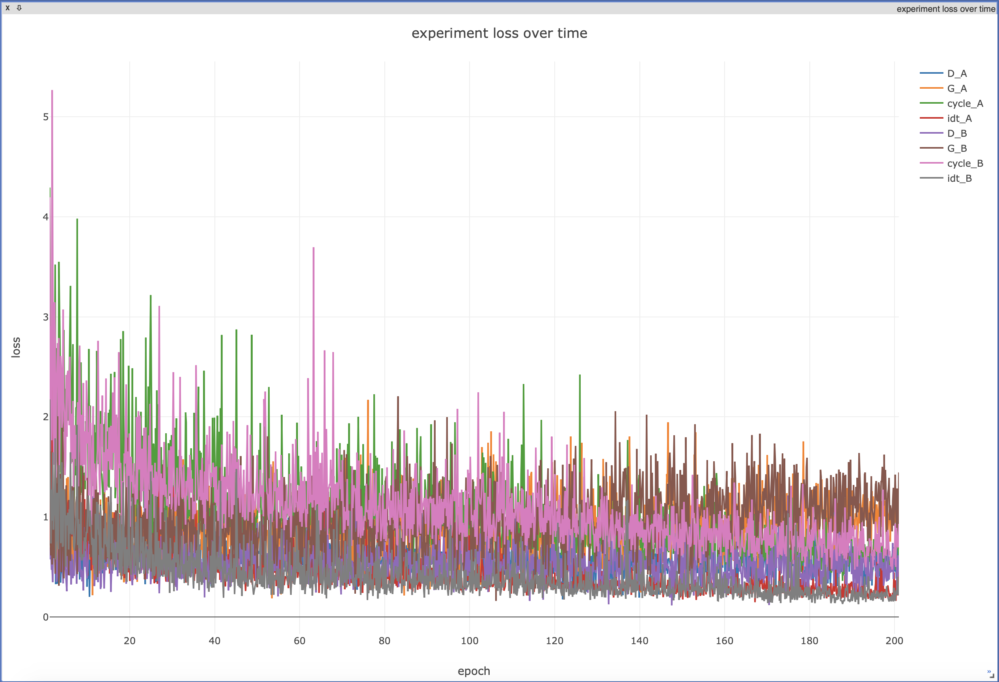

# Pie in The Sky: Food Syle Transfer with Cycle-GAN 

This repo contains the project of [ECE 285f](https://www.math.u-bordeaux.fr/~cdeledal/teaching.php#learningFA18) 2018.
We named this project as `Pie in The Sky` though it is not purely about food generation. But it can generate one type of food from the other, so it makes some `Pie in The Sky`. Actually, we truely get a food generator during the training of model. 

For more test result, please visit our [Project Website](https://sites.google.com/eng.ucsd.edu/ucsd-ece285-foodtrans-yshyl/home)


# Prerequisites
- Python 3.3 or above
- [Pytorch 0.4.0](torch.org)
- [Torchvision](https://github.com/pytorch/vision)
- [visdom visualizer 0.1.8.5](https://github.com/facebookresearch/visdom)
- [dominate 2.3.5](https://github.com/Knio/dominate)

For UCSD `DSMLP` user, you only need to install part of the package with the following command:
```bash
pip3 install visdom==0.1.8.5 --user
pip3 install dominate==2.3.5 --user
pip3 install torchvision --user
```

# Quick Start
In this project, we adopt [visdom](https://github.com/facebookresearch/visdom) for realtime visilization, which enable users to monitor the training process just in thier laptop, without cope another from the server.
So first, launch the visdom server. `Otherwise, the code will raise error!`
```bash
python3 -m visdom.server
```

Or, run it in background
```bash
nohup python3 -m visdom.server
```

To train or test a model with downloaded dataset:(path in `DSMAP`)
```bash
# Training
python3 train.py  
# Testing
python3 test.py 
```

Or, you can monitor your program step by step with Jupter nootbook [train.ipynb](Train.ipynb) and [test.ipynb](Test.ipynb)

# Babysitting your training
Since we have output the training visualization with visdom server to `port:8097`, you can observe the training by your browser. 
Visit `your_server_IP:8097` in your laptop, where `your_server_IP` is the IP address of your server. No password is needed.

You may observe something like that:


# Reproducing test results
- Download the weight and test data from [Drive](https://drive.google.com/drive/folders/1x9ud9-8_Ri5vWiHCkBQQsuH3DixHpWuT?usp=sharing).
- Place the `checkpoints` folder in the project root path, e.g. the same folder as `test.py`.
- Place the `temp_data` folder in anywhere, make sure to change the `config.dataroot = THE_FULL_PATH_TO_TEMP_DATA`, e.g. `config.dataroot = '/home/yuzhe/temp_data'`.

# Results


# Training details
Details of the loss of two Discriminator and Generator:


# Acknowledge
- The code of visualization part comes from [Jun-Yan Zhu](http://people.csail.mit.edu/junyanz/)
- Dataloader is written by [Phillip Isola](https://phillipi.github.io/pix2pix/)

# Author
Yuzhe Qin,Sihan Wang,Hang Zhang,Yawen Zhao,Leyan Zhu
